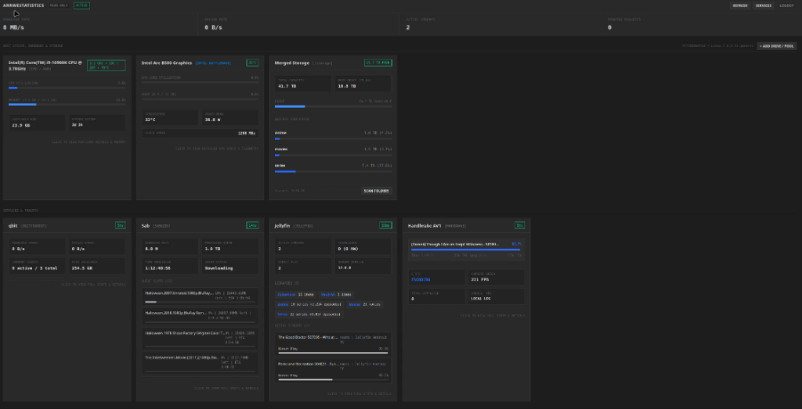
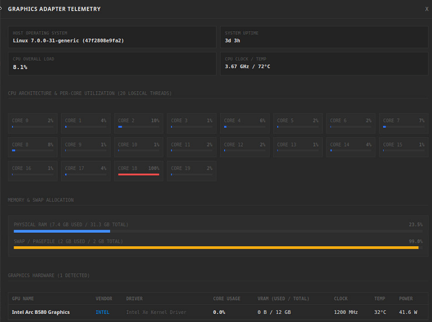
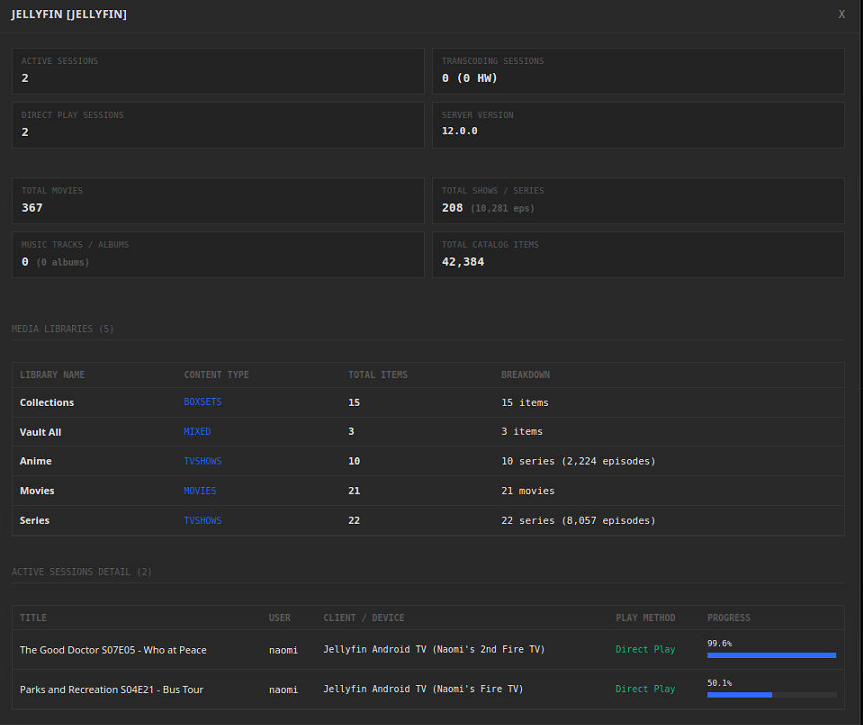
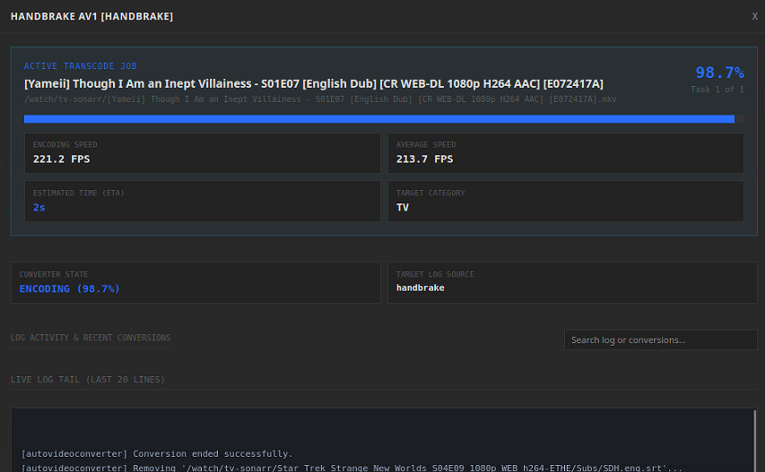

# ArrWeStatistics

Lightweight, single-binary read-only telemetry dashboard for self-hosted media, download, and transcoding stacks. Aggregates live status, speeds, queues, hardware telemetry, and host network statistics from qBittorrent, SABnzbd, Jellyfin, Jellyseerr, HandBrake, and host hardware sensors.

[](https://github.com/EdenFails/ArrWeStatistics/actions/workflows/docker-publish.yml)




---

## Design Invariants

- **Strict Read-Only**: Completely lacks mutation or destructive methods. No endpoints or UI controls exist for pausing, deleting, resuming, or restarting services or downloads.
- **Zero ORM Overhead**: Direct `sqlite3` integration using Write-Ahead Logging (WAL mode), enforced foreign keys, and parameterized queries.
- **Demand-Driven Polling**: Scrapes clients concurrently via `httpx.AsyncClient` only when an active browser tab is viewing the dashboard. Polling pauses on tab visibility loss.
- **In-Memory Cache**: Telemetry queries within the TTL window (default 10s) serve from RAM with 0ms network latency.
- **Hardened Security**: Argon2id password hashing with application-level salting, HttpOnly session cookies, brute-force rate limits, and Content Security Policy headers.

---

## Supported Services & Telemetry

| Service / Target | Protocol / Integration | Scraped Metrics |
| :--- | :--- | :--- |
| **qBittorrent** | WebUI API v2 | Download and upload rates, torrent counts, disk free space, active transfer queue |
| **SABnzbd** | JSON Web API | Queue speed, size remaining, time left, active slot progress |
| **Jellyfin** | REST API | Active playback streams, transcode vs direct play, hardware acceleration, catalog stats |
| **Jellyseerr** | REST API | Request counters (pending, approved, available), recent request logs |
| **HandBrake** | Docker API / Log Tail | Transcoding progress %, FPS, ETA, active job, completion heuristics, history |
| **Hardware Telemetry** | Sysfs / DRM / Xe / NVML | Intel Arc and Battlemage, NVIDIA, AMD Radeon, CPU per-core loads, RAM, and swap |
| **Host Network Telemetry** | Socket / psutil / procfs | Live download and upload speeds, active adapters, daily and all-time bandwidth tracking |
| **Storage Pools** | Host Filesystem VFS | Merged storage capacity, available free space, per-folder item counts, utilization |

---

## Interface & Feature Previews

### Dashboard Overview
Unified dark dashboard displaying live telemetry cards across services, hardware sensors, storage pools, and host network activity.


### Hardware & Dedicated Graphics Telemetry
Drill-down modal with host operating system uptime, CPU architecture and per-core thread utilization, physical RAM and swap allocation, and dedicated graphics adapter telemetry (Intel Arc / Battlemage, NVIDIA, AMD Radeon).



### Jellyfin Media Server Monitoring
Active playback sessions, client platforms, transcoding reasons, audio/video codec details, and total library catalog breakdowns.



### HandBrake Transcoding Engine
Real-time encoding progress, current job information, processing speed (FPS), remaining time (ETA), and live log streaming with automatic completion detection.



---

## Quick Start (Docker Compose)

The pre-built image is published to GitHub Container Registry (`ghcr.io`).

```yaml
version: '3.8'

services:
  arrwestatistics:
    image: ghcr.io/edenfails/arrwestatistics:latest
    container_name: arrwestatistics
    restart: unless-stopped
    ports:
      - "8478:8478"
    environment:
      - HOST=0.0.0.0
      - PORT=8478
      - DB_PATH=/app/data/arrwestatistics.db
      - CACHE_TTL_SECONDS=10
    volumes:
      - ./data:/app/data
      - /var/run/docker.sock:/var/run/docker.sock:ro
      - /proc:/host/proc:ro
      - /sys:/host/sys:ro
    deploy:
      resources:
        limits:
          cpus: '0.50'
          memory: 256M
    healthcheck:
      test: ["CMD", "curl", "-f", "http://localhost:8478/api/health"]
      interval: 30s
      timeout: 5s
      retries: 3
      start_period: 10s
```

Run container:
```bash
docker compose up -d
```
Access dashboard at `http://<server-ip>:8478`.

> [!NOTE]
> On first load, the setup screen prompts for an administrator master password. Once set, the onboarding endpoint permanently locks.

---

## Nginx Proxy Manager Setup

To route ArrWeStatistics through Nginx Proxy Manager (NPM):

<details>
<summary><b>Option 1: Host / Bridge Network (Standard)</b></summary>

If your Docker host runs NPM or you use port forwarding:

1. In NPM, click **Add Proxy Host**.
2. **Details Tab**:
   - **Domain Names**: `stats.yourdomain.com`
   - **Scheme**: `http`
   - **Forward Hostname / IP**: LAN IP of your Docker server (e.g. `192.168.1.50`)
   - **Forward Port**: `8478`
   - Check **Block Common Exploits**
   - Check **Websockets Support**
3. **SSL Tab**:
   - Select or request a Let's Encrypt certificate.
   - Check **Force SSL** and **HTTP/2 Support**.
4. Click **Save**.

</details>

<details>
<summary><b>Option 2: Docker Network Integration (Internal)</b></summary>

If NPM runs in Docker and shares a custom network (e.g. `npm-net`):

1. Add the shared network to `docker-compose.yml`:
   ```yaml
   networks:
     default:
       external:
         name: npm-net
   ```
2. In NPM Proxy Host:
   - **Forward Hostname / IP**: `arrwestatistics`
   - **Forward Port**: `8478`
   - **Scheme**: `http`
   - Check **Websockets Support** and configure SSL.

</details>

---

## Updating the Container

Pull the latest published image and restart:

```bash
docker compose pull
docker compose up -d
```

---

## Local Development

```bash
# Clone repository
git clone https://github.com/EdenFails/ArrWeStatistics.git
cd ArrWeStatistics

# Install requirements
pip install -r requirements.txt

# Run server
python Main.py
```

Run test suite:
```bash
python test_backend.py
```

---

## Project Structure

```
ArrWeStatistics/
├── .github/workflows/
│   └── docker-publish.yml      # Automated GHCR multi-arch build
├── clients/
│   ├── __init__.py             # Client registry and async gather pool
│   ├── handbrake.py            # Docker log stream & log file transcode monitor
│   ├── jellyfin.py             # Active playback and transcode monitor
│   ├── jellyseer.py            # Media request queue scraper
│   ├── qbittorrent.py          # Session-cached torrent monitor
│   └── sabnzbd.py              # Usenet queue and bandwidth scraper
├── docs/
│   └── screenshots/            # Dashboard interface captures
├── WebInterface/
│   ├── index.html              # Single-page interface
│   ├── css/style.css           # Flat minimalist styling
│   └── js/
│       ├── app.js              # State machine and visibility polling loop
│       └── components.js       # Modular service, hardware, and network cards
├── auth.py                     # Salted Argon2id hashing and session manager
├── database.py                 # SQLite WAL connection factory and daily bandwidth storage
├── hardware.py                 # Host CPU, GPU (Intel/AMD/NVIDIA), and network telemetry
├── storage.py                  # Host filesystem mount scanner and folder statistics
├── Main.py                     # FastAPI application root and static mount
├── test_backend.py             # Automated backend and integration test suite
├── Dockerfile                  # Multi-stage Python 3.12 slim build
└── docker-compose.yml          # Container configuration
```

---

<details>
<summary><b>API Route Reference</b></summary>

| Method | Path | Auth | Description |
| :--- | :--- | :--- | :--- |
| `GET` | `/api/health` | Public | Container health check |
| `GET` | `/api/auth/status` | Public | System setup and auth state |
| `POST` | `/api/auth/setup` | Public | Initial master password configuration |
| `POST` | `/api/auth/login` | Public | Authenticates admin session |
| `POST` | `/api/auth/logout` | Required | Revokes session token |
| `GET` | `/api/services` | Required | List configured targets (secrets masked) |
| `POST` | `/api/services` | Required | Register target service |
| `PUT` | `/api/services/{id}` | Required | Update existing service target |
| `POST` | `/api/services/{id}/test` | Required | Run test scrape against target |
| `POST` | `/api/services/test-config` | Required | Test unsaved connection parameters |
| `DELETE` | `/api/services/{id}` | Required | Remove target and cascade metrics |
| `GET` | `/api/telemetry` | Required | Aggregate poll with TTL cache |
| `GET` | `/api/system/stats` | Required | Host hardware, GPU, and network telemetry |
| `GET` | `/api/storage` | Required | Storage pool capacities and folder usage |
| `POST` | `/api/storage` | Required | Configure storage pool mount |
| `PUT` | `/api/storage/{id}` | Required | Update storage pool configuration |
| `DELETE` | `/api/storage/{id}` | Required | Remove storage pool mount |
| `GET` | `/api/filesystem/browse` | Required | Browse host filesystem directories |
| `GET` | `/api/preferences` | Required | Read UI appearance and refresh preferences |
| `POST` | `/api/preferences` | Required | Save UI appearance and refresh preferences |
| `GET` | `/api/metrics/recent` | Required | Historical latency samples |

</details>

---

*Note: Coded with AI.*
